# IronLog

Webowa aplikacja do prowadzenia dziennika treningowego, wzorowana na Hevy. Pozwala rejestrować treningi siłowe na żywo, śledzić progres i rekordy, budować własne szablony treningów i rozmawiać z trenerem AI.

**Demo (produkcja):** https://ironlog-coach.vercel.app
**Repozytorium:** https://github.com/pdudek2/IronLog
Konto testowe: `demo@ironlog.app` / `demo123`

Projekt zaliczeniowy z przedmiotu *Techniki projektowania frontendowego*.

## Screeny aplikacji

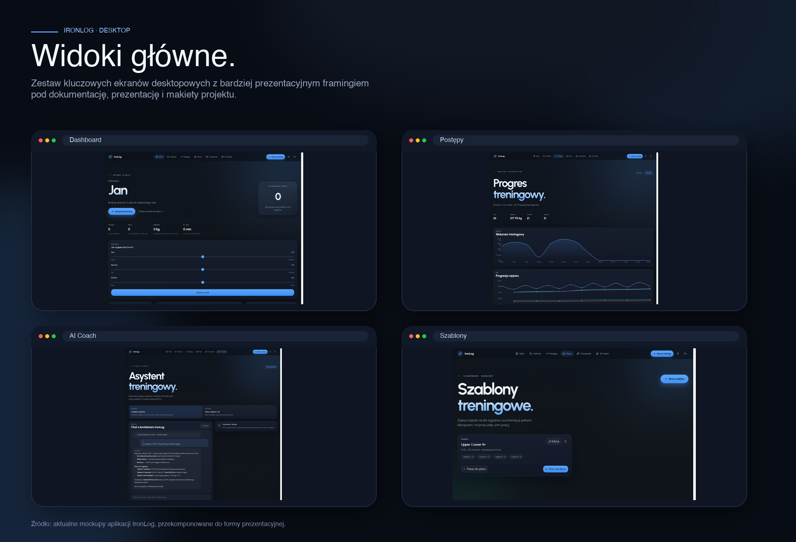

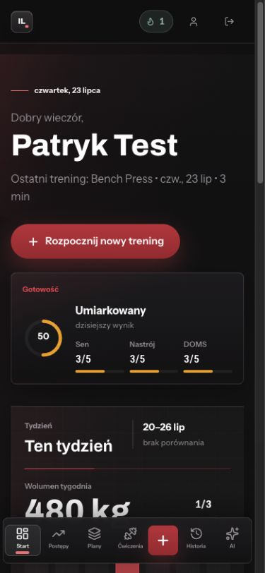

| Ekran | Screen |
|---|---|
| Logowanie | 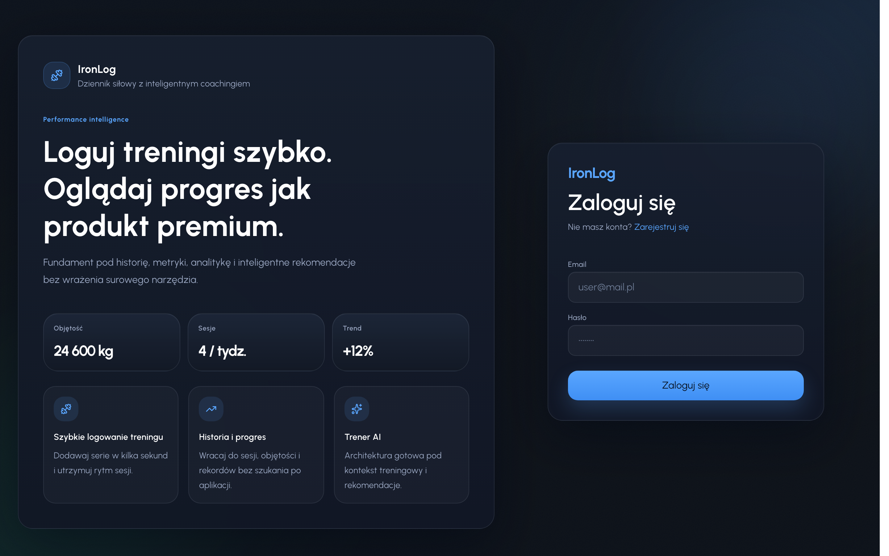 |
| Dashboard | 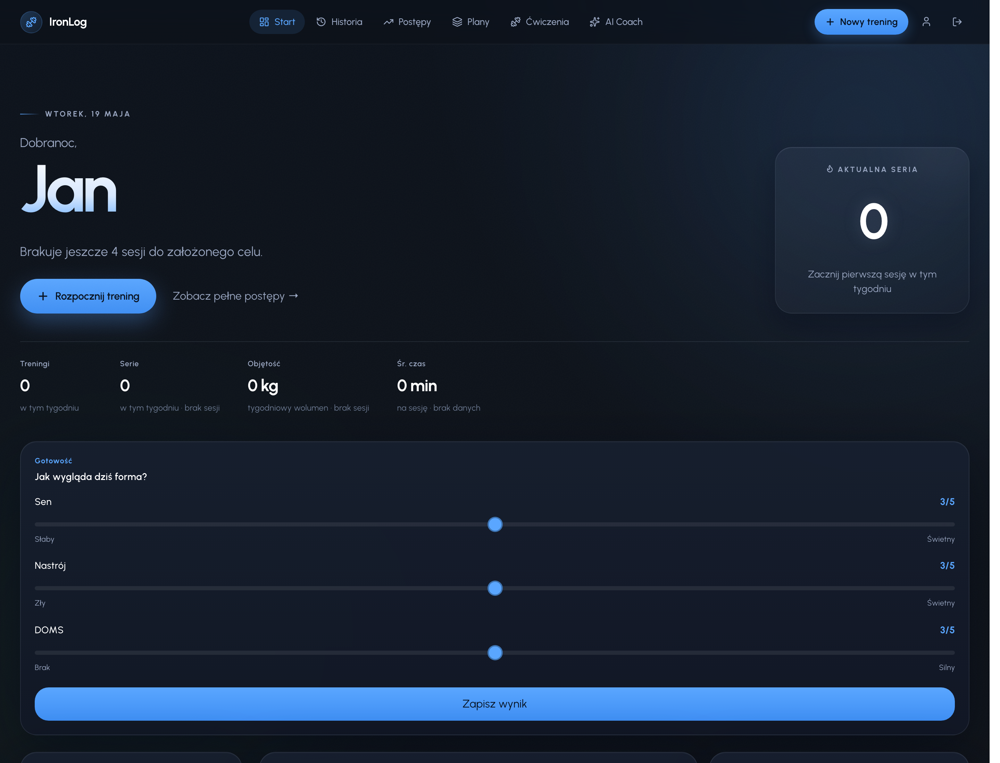 |
| Aktywny trening | 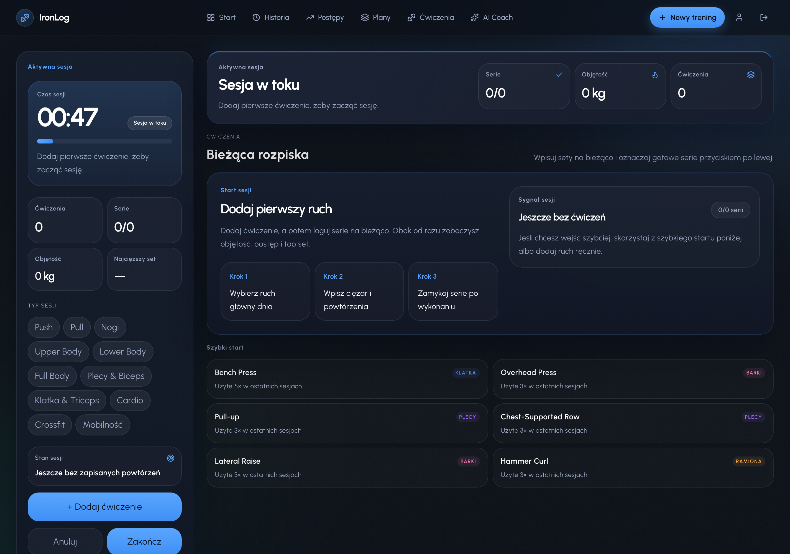 |
| Historia | 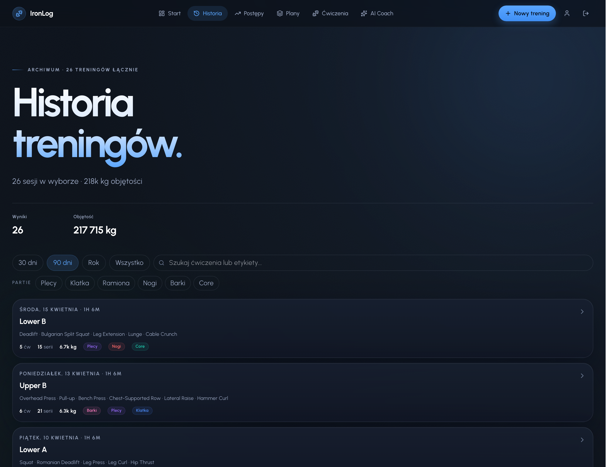 |
| Progres | 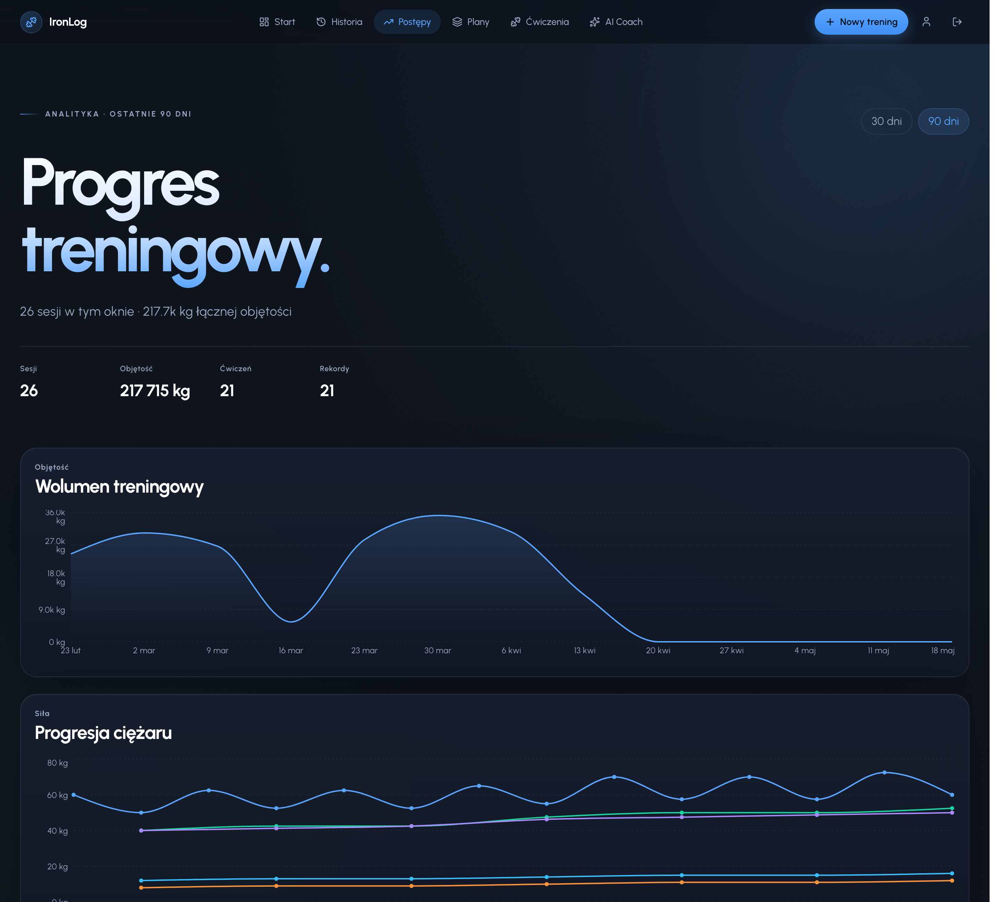 |
| Szablony | 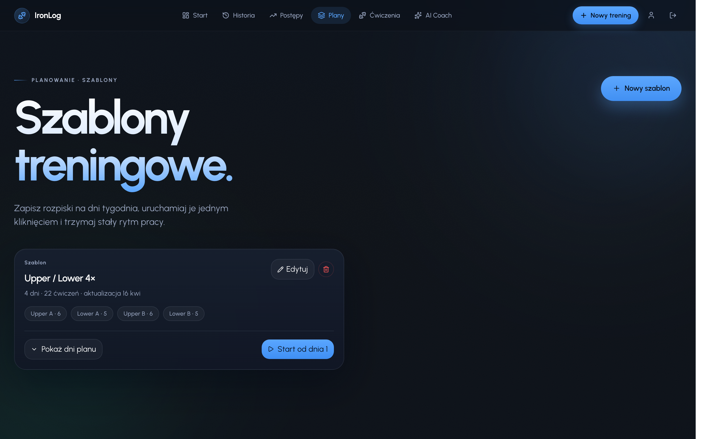 |
| Baza ćwiczeń | 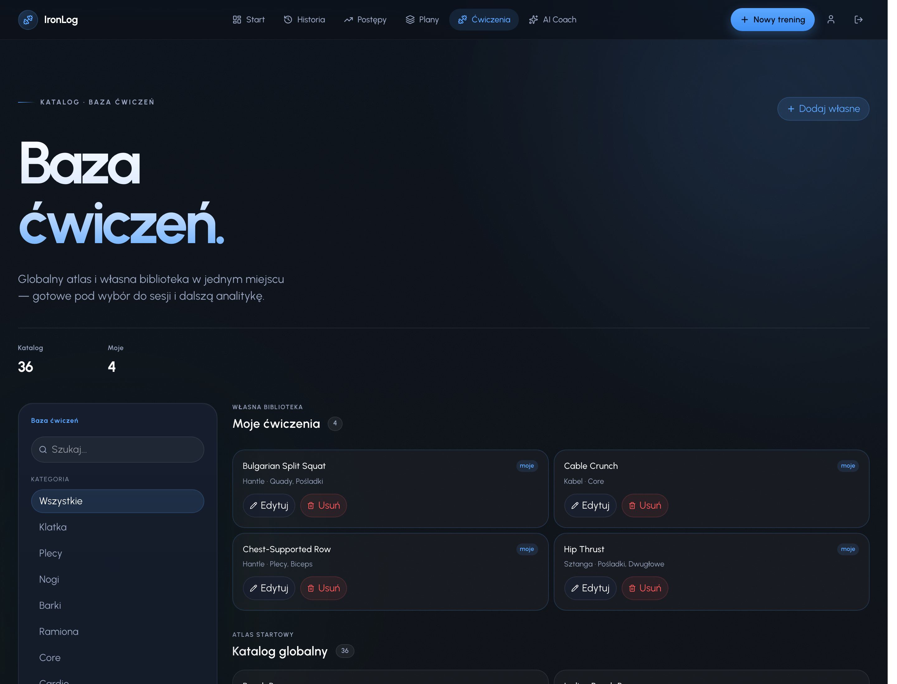 |
| Czat AI | 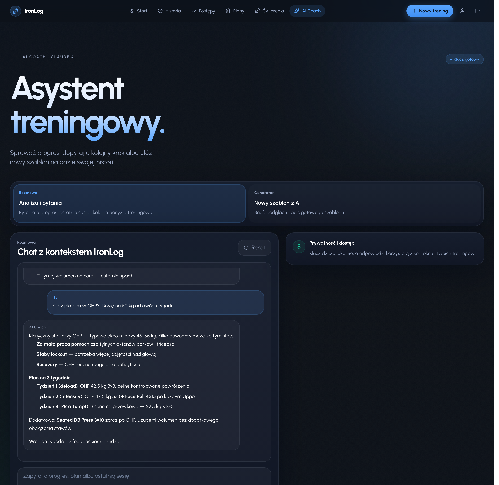 |
| Profil | 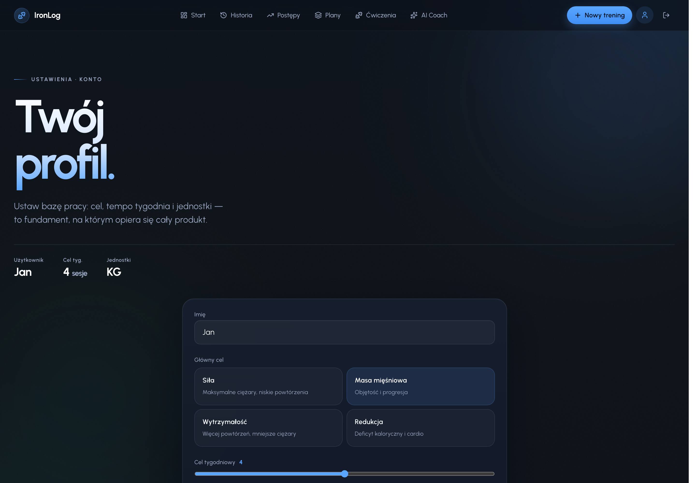 |

## Funkcje

- rejestracja i logowanie (Firebase Authentication, e-mail + hasło),
- rejestrowanie treningu na żywo: serie, powtórzenia, ciężar, rest timer, prefill na podstawie historii,
- historia treningów ze szczegółami każdej sesji,
- wykresy progresu i automatyczne wykrywanie rekordów (PR),
- szablony treningów + własne ćwiczenia użytkownika,
- ankieta gotowości (readiness) przed treningiem,
- czat z trenerem AI przez własny klucz Claude (BYOK) z lekkim limitem per instancja,
- responsywny interfejs mobile-first z osobną nawigacją na desktop.

## Stack

- React 19 + TypeScript + Vite
- React Router 7, Zustand, Framer Motion, Recharts, Tailwind CSS 4
- Firebase Authentication + Firestore
- Vercel Serverless Functions (Node.js, Firebase Admin SDK)
- Hosting: Vercel, auto-deploy z GitHuba
- Analityka opcjonalna po zgodzie: Google Analytics 4 (`react-ga4`) + Hotjar/Contentsquare

## Struktura projektu

```
src/
  pages/        # widoki powiązane z trasami (DashboardPage, WorkoutPage, ...)
  components/   # współdzielone komponenty (TopNav, BottomNav, ExercisePicker, ...)
    ui/         # podstawowe komponenty reużywalne (Button, Card, Input, LoadingState)
  router/       # konfiguracja React Router + lazy loading stron
  store/        # stan globalny (Zustand)
  lib/          # serwisy: Firebase, auth, analityka, logika Firestore
  data/         # globalna baza ćwiczeń (seed)
api/            # endpointy serverless (czat AI, finalizacja treningu)
```

## Routing

Wszystkie ekrany są dostępne przez React Router (nawigacja bez przeładowania strony). Trasy prywatne są chronione — bez zalogowania następuje przekierowanie na `/login`. Strony ładują się lazy (code-splitting per trasa), a widoki prywatne współdzielą jeden layout (`AppLayout`).

| Trasa | Ekran | Dostęp |
|---|---|---|
| `/login`, `/register` | logowanie / rejestracja | publiczny |
| `/onboarding` | konfiguracja konta | prywatny |
| `/dashboard` | dashboard | prywatny |
| `/workout/new` | aktywny trening | prywatny |
| `/workout/:id` | szczegóły treningu | prywatny |
| `/history` | historia treningów | prywatny |
| `/progress` | wykresy progresu | prywatny |
| `/templates`, `/templates/new`, `/templates/:id/edit` | szablony | prywatny |
| `/exercises`, `/exercises/:source/:id` | baza ćwiczeń | prywatny |
| `/chat` | czat AI | prywatny |
| `/profile` | profil | prywatny |
| `*` | strona 404 | publiczny |

## Logowanie

Uwierzytelnianie przez Firebase Authentication (metoda Email/Password). Stan sesji trzymany jest w store Zustand i zasilany przez `onAuthStateChanged`, więc odświeżenie strony nie wylogowuje użytkownika. Komponenty `PrivateRouteOutlet` / `PublicRouteOutlet` w `src/router/index.tsx` pilnują dostępu do tras.

## Google Analytics

Integracja przez `react-ga4` (`src/lib/analytics.ts`). GA4 nie inicjalizuje się przed zgodą użytkownika. Po wybraniu „Akceptuję analitykę” aplikacja uruchamia GA4 i wysyła zdarzenie `pageview` przy zmianie trasy (`AnalyticsListener` + `useLocation`). Przy wyborze „Tylko niezbędne” pageview nie jest wysyłany.

Identyfikator pomiaru jest podawany przez zmienną środowiskową `VITE_GA_MEASUREMENT_ID` — bez niej moduł nie inicjalizuje się nawet po zgodzie.

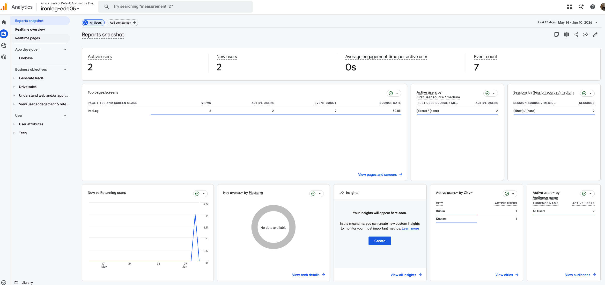
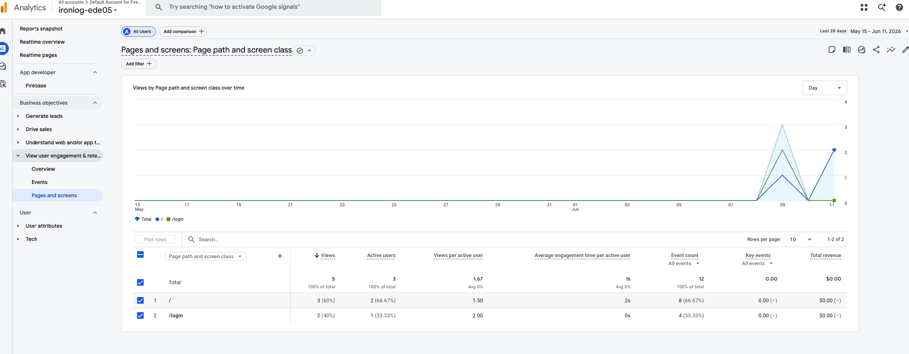

## Hotjar (Contentsquare)

Hotjar działa obecnie na platformie Contentsquare — nowe konta zamiast numerycznego Site ID dostają tag identyfikowany hashem. Skrypt Session Replay/heatmap jest doładowywany dopiero po zgodzie użytkownika, hash podaje zmienna `VITE_CSQ_TAG_ID`. Starszy numeryczny `VITE_HOTJAR_SITE_ID` zostaje jako fallback.

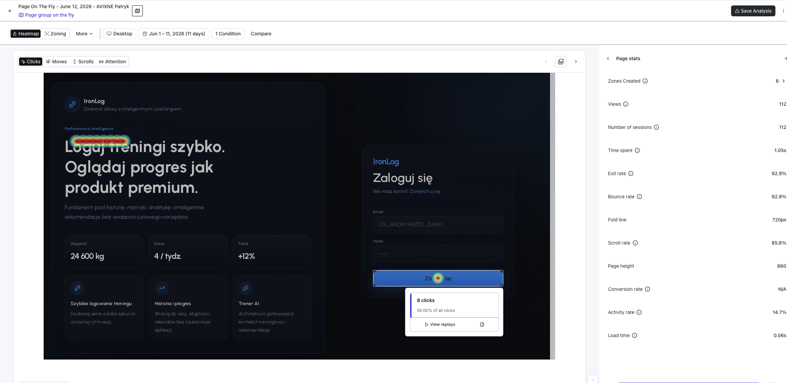
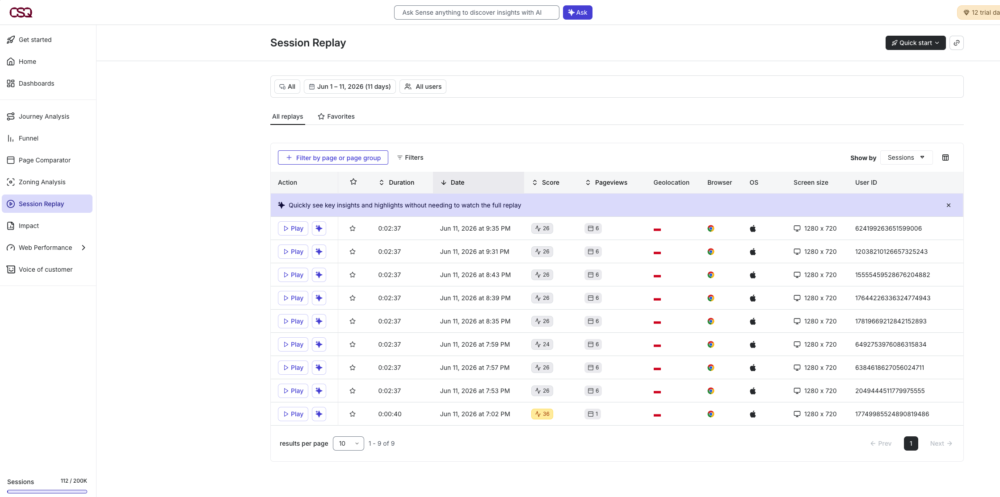

## Prywatność i zgoda

Zgoda na analitykę jest zapisywana lokalnie w przeglądarce (`localStorage`) jako wybór `granted` albo `denied`. Brak wyboru oznacza brak inicjalizacji GA4 i Contentsquare/Hotjar. Użytkownik może zmienić zgodę w profilu.

Klucz Claude w modelu BYOK również jest przechowywany lokalnie w przeglądarce. Nie zapisujemy go w Firestore; backend serverless używa go tylko do obsłużenia bieżącego zapytania do Anthropic.

## AI Coach

Czat AI działa w modelu BYOK: użytkownik podaje własny klucz Claude, który jest przechowywany lokalnie w przeglądarce. Backend serverless pośredniczy w wywołaniach Anthropic i dodaje kontekst profilu, gotowości, ostatnich sesji oraz rekordów.

Obecny limit jest lekki i procesowy (`8/min` na użytkownika + IP w pamięci instancji serverless). Nie jest to jeszcze trwały dzienny limit produktowy: kolekcja `dailyAiUsage` nie jest obecnie używana, a wiadomości czatu nie są persystowane w `chatMessages`.

## Uruchomienie lokalne

```bash
npm install
cp .env.example .env.local   # uzupełnij wartości
npm run dev                  # frontend (Vite)
npm run dev:all              # frontend + lokalne API
```

Wymagane zmienne środowiskowe — patrz `.env.example`. Konfiguracja Firebase pochodzi z konsoli Firebase (Project settings → Web app). Zmienne analityki (`VITE_GA_MEASUREMENT_ID`, `VITE_CSQ_TAG_ID`) są opcjonalne — bez nich analityka jest po prostu wyłączona.

## Testy

```bash
npm run test:unit    # testy jednostkowe (Vitest)
npm run test:rules   # testy reguł Firestore (emulator)
npm run test:e2e     # testy end-to-end (Playwright)
```

## Deploy

Aplikacja jest wdrożona na Vercel (preset Vite + funkcje serverless w `api/`). Każdy push na `main` uruchamia automatyczny deploy. Zmienne środowiskowe są ustawione w panelu Vercela.
